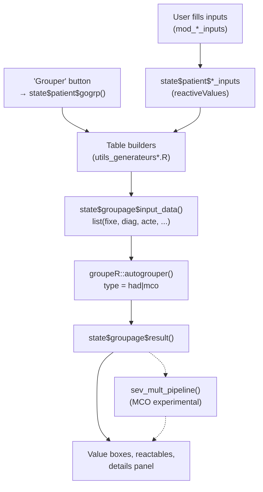

# Hadvisor Architecture Reference

## R6 State Hierarchy

```
AppState (root) ── R/fct_app_state.R
├── startup: reactiveVal(TRUE)
├── sector: reactiveVal("had")        # "had" | "mco"
│
├── had: HadState
│   ├── patient: HadPatientState
│   │   ├── n_seq_current()            # current sequence count displayed
│   │   ├── n_seq(), add_n_seq()       # triggers from sidebar inputs
│   │   ├── seqnames()                 # list: "sequence_inputs_1", ...
│   │   ├── seqno()                    # current sequence being edited
│   │   ├── seq_inputs                 # reactiveValues: per-sequence input storage
│   │   ├── copy()                     # clipboard for copy/paste
│   │   ├── gogrp()                    # trigger to run grouper
│   │   └── ident_sej()               # random stay identifier
│   └── groupage: HadGroupageState
│       ├── result()                   # groupeR::autogrouper() output
│       ├── details()                  # toggle details panel
│       ├── history()                  # list of past GPSL results
│       └── input_data()              # assembled tables for groupeR
│
└── mco: McoState
    ├── patient: McoPatientState
    │   ├── n_rum_current()            # current RUM count displayed
    │   ├── n_rum(), add_n_rum()       # triggers from sidebar inputs
    │   ├── rumnames()                 # list: "rum_inputs_1", ...
    │   ├── rumno()                    # current RUM being edited
    │   ├── rum_inputs                 # reactiveValues: per-RUM input storage
    │   ├── sejour_inputs              # reactiveValues: stay-level inputs
    │   ├── copy()                     # clipboard for copy/paste
    │   ├── gogrp()                    # trigger to run grouper
    │   └── ident_sej()               # random stay identifier
    └── groupage: McoGroupageState
        ├── result()                   # groupeR::autogrouper() output
        ├── details()                  # toggle details panel
        ├── history()                  # list of past results
        └── input_data()              # assembled tables for groupeR
```

**Key principle:** State is passed **by reference** (R6) to all modules. Reactive slots (`reactiveVal`, `reactiveValues`) give Shiny reactivity. The single `AppState` root is created in `app_server.R` and threaded through every module via the `state` argument.

## Module Map

### Application Shell

| File | Role |
|------|------|
| `R/app_ui.R` | `page_sidebar()` layout: sector radio, n_seq/n_rum controls, "Grouper" button, `navset_hidden` with HAD/MCO panels |
| `R/app_server.R` | Creates `AppState`, wires sector switching, forwards sidebar inputs to state, dispatches `gogrp()` per sector |
| `R/run_app.R` | Golem entry point: `run_app()` |
| `R/app_config.R` | `get_golem_config()`, `app_sys()` helpers |

### HAD Modules

| File | UI | Server |
|------|-----|--------|
| `R/mod_patients.R` | Card with accordion of sequences | Dynamic sequence add/remove, calls `mod_sequence_inputs_server` per sequence |
| `R/mod_sequence_inputs.R` | 3-column layout: MPP/MPA/age, DP/DCMPP/DCMPA, DA + copy/paste | Stores inputs to `state$patient$seq_inputs[[module_name]]` |
| `R/mod_groupage.R` | Hidden result card: 3 value boxes (GP, Severite, Lourdeur) + details panel | Assembles HAD tables, calls `autogrouper(type="had")`, renders results |

### MCO Modules

| File | UI | Server |
|------|-----|--------|
| `R/mod_mco_patients.R` | Card: sejour inputs + accordion of RUMs | Dynamic RUM add/remove, calls `mod_mco_rum_inputs_server` per RUM |
| `R/mod_mco_sejour_inputs.R` | Demographics (age, sexe), entry/exit modes, flags (RAAC, lit_palliatif), optional switches | Stores to `state$patient$sejour_inputs` |
| `R/mod_mco_rum_inputs.R` | 3-column: DP/DR/DAS, actes modal, type_rum/duree_rum + copy/paste | Stores to `state$patient$rum_inputs[[module_name]]` |
| `R/mod_mco_actes_modal.R` | Label + compacted display + edit button opening modal | Modal with virtualSelectInput for CCAM codes + activite 4 checkboxes; returns `reactiveVal(tibble(acte, activ_4))` |
| `R/mod_groupage_mco.R` | Hidden result card: 2 value boxes (GHM, GHS) + severity progression + experimental sev_mult panel | Assembles MCO tables, calls `autogrouper(type="mco")`, optional `sev_mult_pipeline()` |

### Utilities

| File | Purpose |
|------|---------|
| `R/utils_generateurs.R` | HAD table builders: `make_tbl_had_fixe()`, `make_tbl_had_fixe_sej()`, `make_tbl_had_diag()`, `make_tbl_had_acte()`, `init_input_default_vals()` |
| `R/utils_generateurs_mco.R` | MCO table builders: `make_mco_tbl_fixe()`, `make_mco_tbl_fixe_2()`, `make_mco_tbl_diag()`, `make_mco_tbl_acte()`, `make_mco_tbl_um()`, `assemble_mco_grouper_data()`, defaults |
| `R/utils_severite_mult.R` | Experimental MCO 5-level severity: `sev_mult_pipeline()` and 8 pure step functions |
| `R/utils_ui_generators.R` | `bttnCopyPaste()` helper |
| `R/utils_ui_updaters.R` | HAD: `update_all_inputs()` for virtualSelect/numeric sync |
| `R/utils_ui_updaters_mco.R` | MCO: `update_all_mco_inputs()` for RUM input sync |
| `R/waiters.R` | `wait_screen_inputs()` loading spinner |

## Data Flow Diagram



## groupeR Integration

**HAD call** (in `mod_groupage_server`):
```r
groupeR::autogrouper(
  .data = list(fixe = ..., fixe_sej = ..., diag = ..., acte = ...),
  type = "had", version = "vExp",
  sources = groupeR::referentiels$had$vExp
)
```

**MCO call** (in `mod_groupage_mco_server`):
```r
groupeR::autogrouper(
  .data = list(fixe = ..., fixe_2 = ..., diag = ..., acte = ..., um = ..., autor_pgv = ...),
  type = "mco", version = "v2025",
  sources = groupeR::referentiels$mco$v2025  # with patched xclu_dasdas
)
```

**Result extraction paths** (MCO example):
- `result$data$output$grp_ghm_all[1]` — GHM code
- `result$data$output$grp_ghs_tot_all` — GHS public/private
- `result$data$output$grp_cmd` — CMD
- `result$data$output$grp_racine_all` — GHM racine
- `result$data$output$sev_niv_das_init` — DAS severity levels (feeds sev_mult)

**IMPORTANT:** Always use the `grouper-consumer` skill when interacting with groupeR. It documents the full API, table schemas, and version-specific quirks.

## Observer Priority Order (app_server.R)

1. **Sector switching** — `input$sector` → `state$sector()` + `bslib::nav_select()`
2. **N-sequence/N-RUM forwarding** — sidebar inputs → state triggers
3. **Global "Go" button** — `input$go` → dispatches `gogrp()` to active sector's patient state

**Module-level priorities:**
- **9999** (first): Add/remove accordion panels dynamically
- **99**: Generate random `ident_sej`
- **97**: Assemble `input_data` when `gogrp()` fires

## Test Structure

| Test File | Covers |
|-----------|--------|
| `test-utils_severite_mult.R` | Sev_mult pure functions + integration with reference tables |
| `test-utils_generateurs_mco.R` | MCO builder functions, `assemble_mco_grouper_data()` |
| `test-utils_generateurs.R` | HAD builder functions |
| `test-mod_mco.R` | MCO R6 state, module UIs, end-to-end pipeline |
| `test-autogrouper_integration.R` | HAD builders → autogrouper → result parsing |
| `test-mod_groupage.R` | HAD groupage module UI |
| `test-mod_patients.R` | HAD patients module UI |
| `test-mod_sequence_inputs.R` | HAD sequence inputs module UI |

**Pattern:** `skip_if_not_installed("groupeR")` for integration tests. State isolation via `shiny::isolate()`.

## Bundled Data

- `data/sysdata.rda` — Reference tables: `sev_mult_prio`, `sev_mult_dimension`, `sev_mult_combi`, `sev_mult_fse`, input choice vectors (`cim_input`, `mpp_input`, `mpa_input`, `um_input`, etc.)
- `inst/extdata/mco/` — Parquet files: DAS-DAS exclusions, type_rum mappings
- `data-raw/sources_default.R` — Script that builds the sysdata from groupeR referentials
